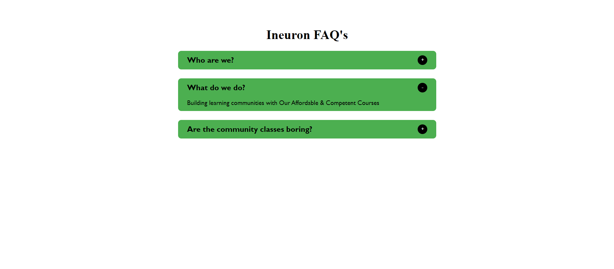

## What to build

we have to build Accordion.

## Techanology used

we have used HTML, CSS and JavaScript DOM

## What I have learned from this project

I have learned how get element from page, How to add class list to that element and how to remove class list from that elemt and adding event Listner using dom

## Output

### And

### Instructor

**Hitesh choudhary**
